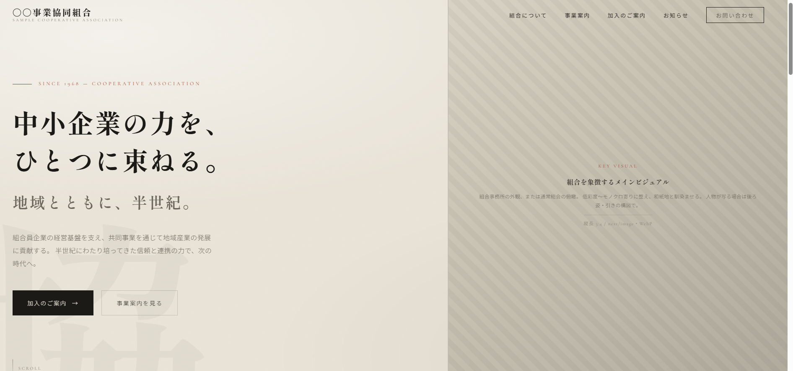

# 事業協同組合ポータル — サンプル実装

ポートフォリオ用サンプルサイト。クラウドワークスで見かけた「事業協同組合ポータルのUI/UX刷新」案件を題材に、**モノトーン＋和紙質感**のデザインをNext.jsで実装したもの。

> ⚠️ 実在する組合・団体とは一切関係ありません。掲載の組合名・住所・電話番号はすべてダミーです。

## スクリーンショット



## 技術スタック

| 項目 | 内容 |
|---|---|
| フレームワーク | Next.js 16（App Router） |
| 言語 | TypeScript |
| スタイリング | Tailwind CSS v4 + CSS カスタムプロパティ |
| フォント | Shippori Mincho / Noto Sans JP / Cormorant Garamond（`next/font`） |
| デプロイ | Vercel |

## デザインの特徴

- **和紙トーン**: `--paper` (#e9e4d8) をベースに、`body::before` で SVG feTurbulence ノイズを薄く重ねた質感
- **光のムラ**: `body::after` の radial-gradient で四隅に明暗
- **差し色は朱のみ**: `--shu` (#9e3b25) をラベル・罫線・ホバーにのみ使用
- **フェードイン**: IntersectionObserver による `.reveal` / `.in` の scroll-linked アニメーション（ライブラリなし）

## ページ構成（ホームのみ実装）

| セクション | 内容 |
|---|---|
| Header | 固定。スクロール60px超で半透明＋blur |
| Hero | 2カラムグリッド、ウォーターマーク「協」、stagger fade-in |
| About | リード引用文＋縦長ビジュアル |
| Business | 3列×6カード、極細罫線グリッド |
| Stats | 墨背景帯に数値4項目 |
| News | 一覧。ホバーで左シフト |
| CTA | 加入のご案内 |
| Footer | 墨背景3カラム |

画像はすべてプレースホルダー（`components/Placeholder.tsx`）で差し替え前提。

## セットアップ

```bash
npm install
npm run dev
```

[http://localhost:3000](http://localhost:3000) で確認。

## ブランチ運用

```
main        — リリースブランチ
develop     — 統合ブランチ
feature/*   — 機能開発
```

## ライセンス

MIT — ポートフォリオ目的での参照・改変はご自由にどうぞ。
